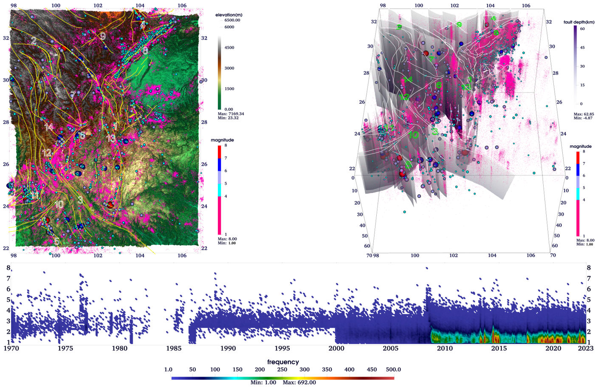
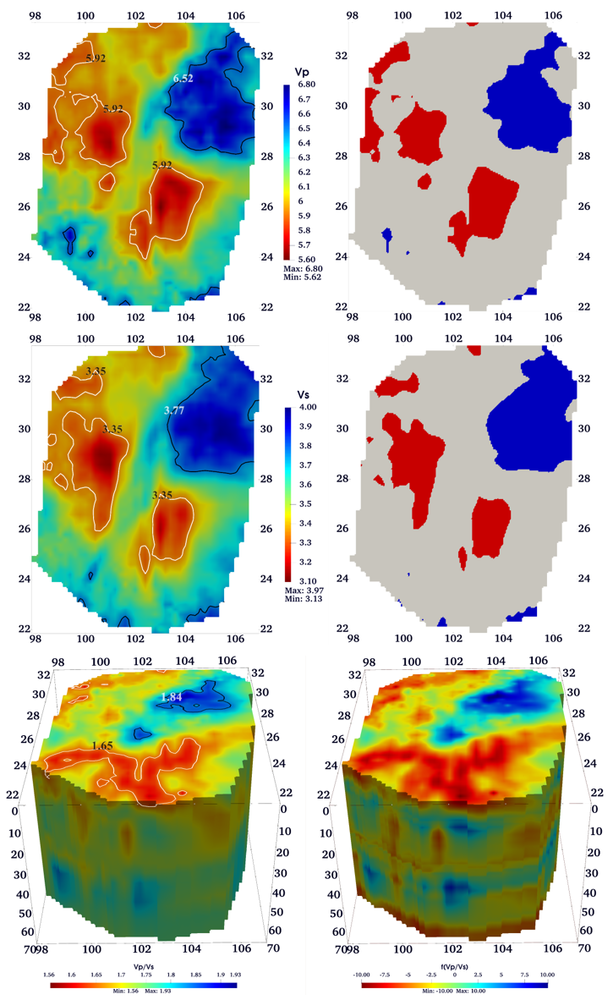
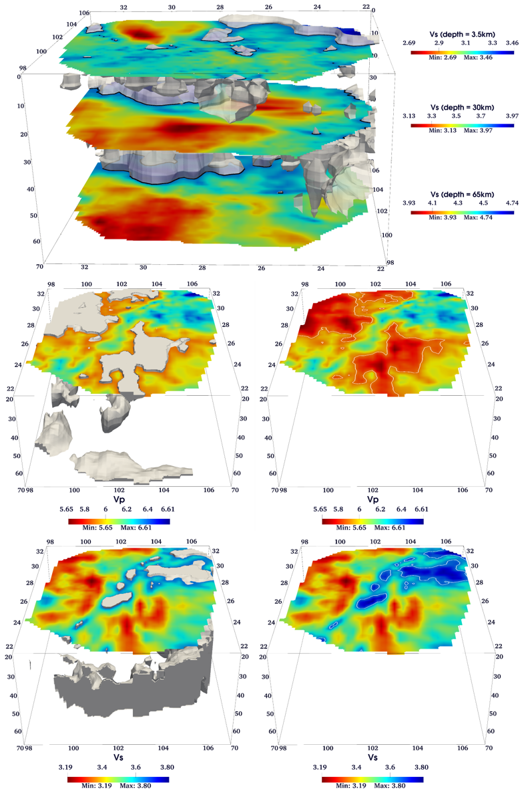
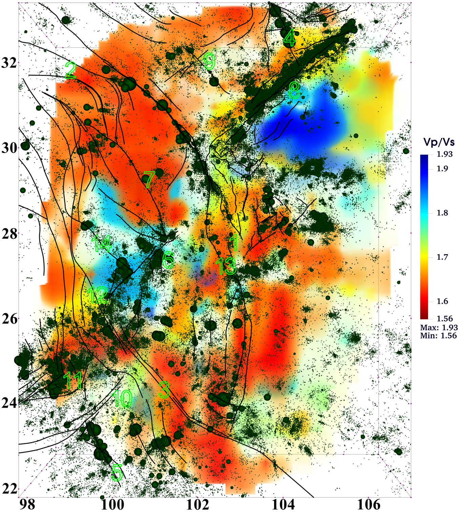

# Geodynamic Activity Characteristics in the Sichuan–Yunnan Region Revealed by Big Data Analysis


## 0. Description


This document presents a novel visualization method for geoscience volume data, utilizing the Community Velocity Model (CVM) "SWChinaCVM-2.0" for the Sichuan–Yunnan region. By integrating scientific visualization techniques such as Ray Casting volume rendering, Marching Cubes Iso-surface extraction, and hybrid rendering, we developed a two-dimensional transfer function related to velocity magnitude to quantitatively represent high- and low-velocity anomalies. Combining geoscience big data, including high-resolution topography, three-dimensional active faults, earthquake catalogs, and the Moho discontinuity, we visually and quantitatively display the spatial distribution and thickness of velocity anomalies at various layers within the CVM. Additionally, we illustrate their relationships with faults, the Moho discontinuity, and historical large earthquake hypocenters using three-dimensional stereograms and animations with varying camera perspectives.


## 1. Background

The Sichuan–Yunnan region, located at the southeastern margin of the Tibetan Plateau, exhibits a predominantly clockwise rotational crustal movement pattern based on GPS observations.

<p align="center">
  <br />
  *Tectonic background map of the Sichuan–Yunnan region and its surroundings*
</p>

This region is characterized by complex tectonic deformation, deep active faults, and frequent earthquakes.

<p align="center">
  <br />
  *2D/3D scatter plot of earthquakes, 3D faults, and elevation*
</p>

Therefore, establishing a Community Velocity Model (CVM) is as crucial as its visualization and post-processing analysis in this region.


## 2. Data

1. **[SWChinaCVM-2.0 Model Data](http://cses.ac.cn/sjcp/ggmx/2022/589.shtml)**
2. **[High-Resolution Topography Data (NOAA National Centers for Environmental Information, 2022)](https://www.ncei.noaa.gov/products/etopo-global-relief-model)**
3. **[Three-Dimensional Fault Data](http://cses.ac.cn/sjcp/ggmx/2024/609.shtml)**
4. **[Crustal Depth Data](https://www.sciencedirect.com/science/article/abs/pii/S0040195113006847?via%3Dihub)**
5. **[GPS Velocity Field](https://agupubs.onlinelibrary.wiley.com/doi/10.1029/2019JB018774)**
6. **Earthquake Catalog Data**


## 3. Method

### 3.1 Transfer Functions of Velocity

In geosciences, velocity anomalies of interest typically refer to regions with significantly higher (high-velocity anomalies) or lower (low-velocity anomalies) velocity values compared to the background within the same depth range. Since velocity generally increases with depth, the scalar velocity-to-color mapping varies for each layer. Therefore, it is necessary to unify the mapping range of the entire CVM volume data first:

<p align="center">
  <br />
</p>

### 3.2 Comparison

<p align="center">
  <br />
  *Comparison of the separation effect between the CVM data and high- and low-velocity anomalies mapped by the Transfer Functions.*
</p>

<p align="center">
  <br />
  *Comparison between the 3D reconstruction results of velocity anomalies and the original CVM data.*
</p>


## 4. Results

### 4.1 3D Spatial Distribution of Vₚ Anomalies in the Sichuan–Yunnan Region

<p align="center">
  <br />
  *3D spatial distribution of P-wave velocity anomalies in the Sichuan–Yunnan region (vertical exaggeration of ten times). (a) High-velocity anomalies; (b) Low-velocity anomalies. Solid lines represent active faults. The light gray surface denotes the Moho surface.*
</p>

### 4.2 3D Spatial Distribution of Vₛ Anomalies in the Sichuan–Yunnan Region

<p align="center">
  <br />
  *3D spatial distribution of S-wave velocity anomalies in the Sichuan–Yunnan region (vertical exaggeration of ten times). (a) High-velocity anomalies; (b) Low-velocity anomalies. Solid lines represent active faults. The light gray surface denotes the Moho surface.*
</p>

### 4.3 3D Spatial Distribution of Vₚ/Vₛ Ratio Anomalies in the Sichuan–Yunnan Region

<p align="center">
  <br />
  *Anomalous distribution of the Vₚ/Vₛ ratio in the Sichuan–Yunnan region (vertical exaggeration of ten times). (a) High Vₚ/Vₛ anomalies; (b) Low Vₚ/Vₛ anomalies. Solid lines represent active faults. The light gray surface denotes the Moho surface.*
</p>

### 4.4 Volume Rendering of the Vₚ and Vₛ Anomalies

<p align="center">
  <br />
  *Volume rendering results of Vₚ (left) and Vₛ (right) combining high- and low-velocity anomalies (vertical exaggeration of ten times). Warm red indicates low-velocity anomalies; cool green indicates high-velocity anomalies. Solid lines represent active faults.*
</p>

### 4.5 Volume Rendering of the Vₚ/Vₛ Ratio Anomalies

<p align="center">
  <br />
  *Volume rendering results of the Vₚ/Vₛ ratio combining high- and low-velocity anomalies (vertical exaggeration of ten times). Warm red indicates low-velocity anomalies; cool green indicates high-velocity anomalies. Solid lines represent active faults.*
</p>

### 4.6 Comprehensive Spatial Distribution Relationship Diagram

<p align="center">
  <br />
  *Spatial relationships between high- and low-velocity anomalies and earthquake hypocenter locations at different depth ranges (vertical exaggeration of ten times). In each panel, the left side shows P-wave anomalies, and the right side shows S-wave anomalies. Warm red indicates low-velocity anomalies; cool green indicates high-velocity anomalies. Colored vertical planes represent 3D active faults. Small particle spheres represent earthquakes within the respective depth ranges. The light gray surface represents the Moho discontinuity.*
</p>


## 5. Comprehensive 3D Animation

This video integrates over 420,000 earthquake entries of magnitudes 1.0 and above from the Sichuan–Yunnan region, covering the period from 1970 to 2020. It includes data on more than 160 three-dimensional active faults, high-precision topographic information, community velocity models, and the depth of the Moho surface. Comprehensive analysis reveals the geodynamic activity characteristics of the Sichuan–Yunnan region.

[](https://youtu.be/x29ss0pleRU)
*(Complete 3D Visualization Video: [Watch on YouTube](https://youtu.be/x29ss0pleRU))*


## How to Use

### 1. Installation

#### 1.1 Clone the Repository

Clone the repository to your local machine:

```bash
git clone https://github.com/peixyhe/CVM_vis_demo.git
cd CVM_vis_demo-main
```

#### 1.2 Create a Conda Environment

This project relies on several libraries, which can be installed via the `environment.yml` file. Key dependencies include:

- **NumPy**: For numerical operations;
- **Pandas**: For data manipulation and analysis;
- **SciPy**: For spatial data processing with cKDTree;
- **Trimesh**: For 3D mesh processing;
- **VTK**: For 3D visualization and rendering;
- **xarray**: For handling multi-dimensional arrays;
- **tqdm**: For progress bars;
- **pymeshlab**: For mesh processing with MeshLab;
- **pyproj**: For geographic projections and coordinate transformations.

Install all required dependencies:

```bash
conda env create -f environment.yml
conda activate CVM_vis_env
```

#### 1.3 Usage

Run the desired script. If any areas are unclear, refer to the comments regarding the main function in each script. For example:

##### Example 1: Compute and Visualization of the CVM

```bash
python src/CVM_vis.py
```

This command inputs raw CVM data in TXT format and outputs a PNG result and a VTK file for further visualization.

##### Example 2: Moho Surface

```bash
python src/crust.py
```

This command inputs the depth of Moho data in TXT format, generating a PNG result and a VTK file.

## Citation

If this work is useful to you, please cite the following source:

He, Pei, et al. "Geodynamic Activity Characteristics in the Sichuan–Yunnan Region Revealed by Big Data Analysis." This work is currently under review, and specific publication details will be provided upon acceptance.

## License

This project is licensed under the MIT License. See the [MIT License](LICENSE) file for details.

---
